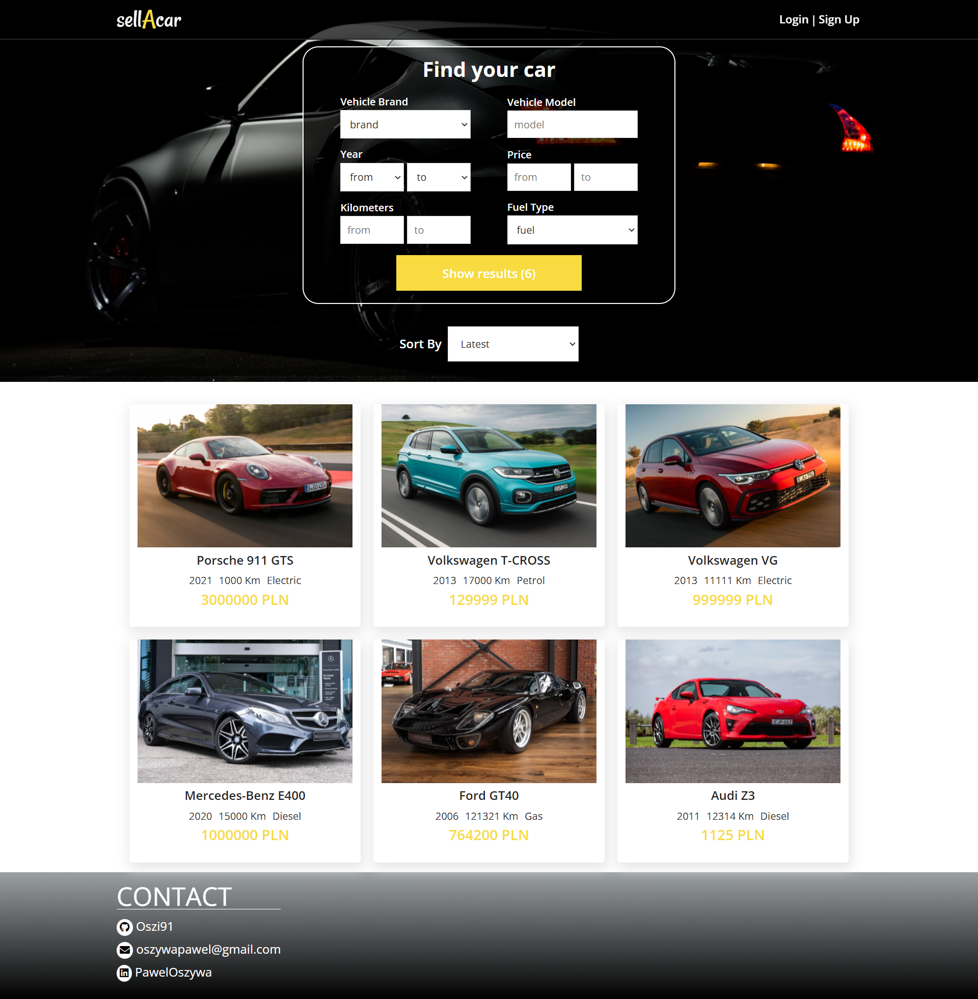
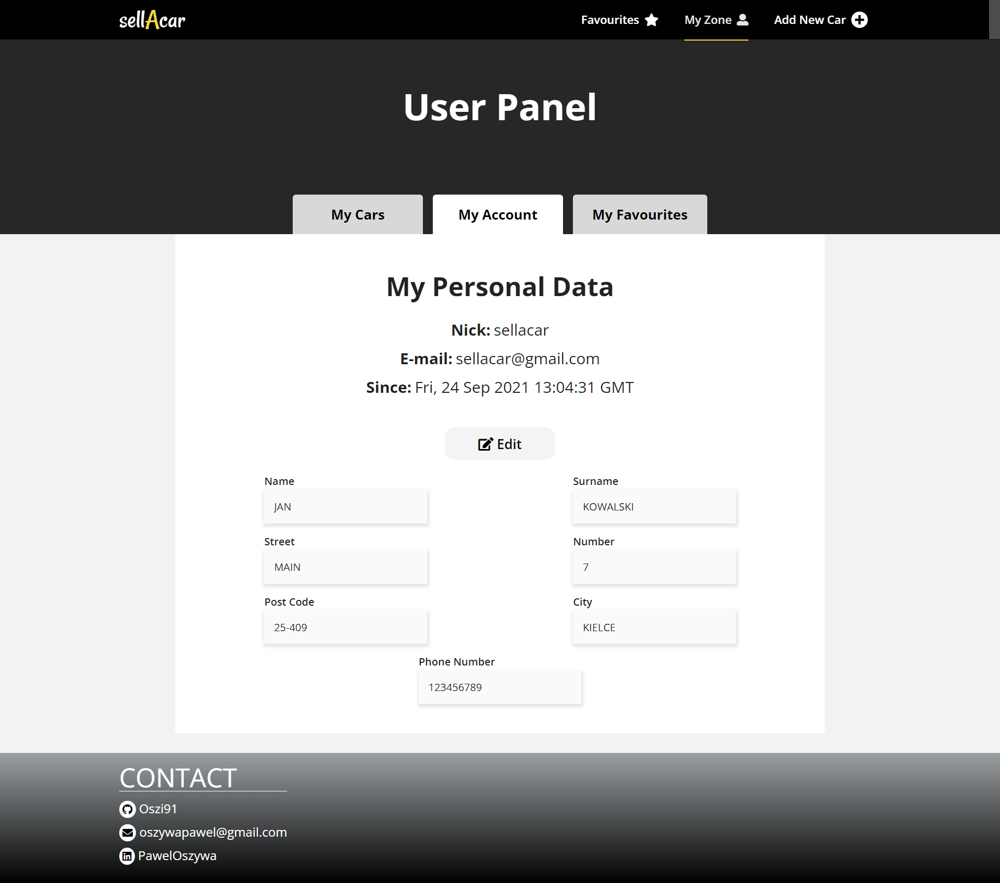
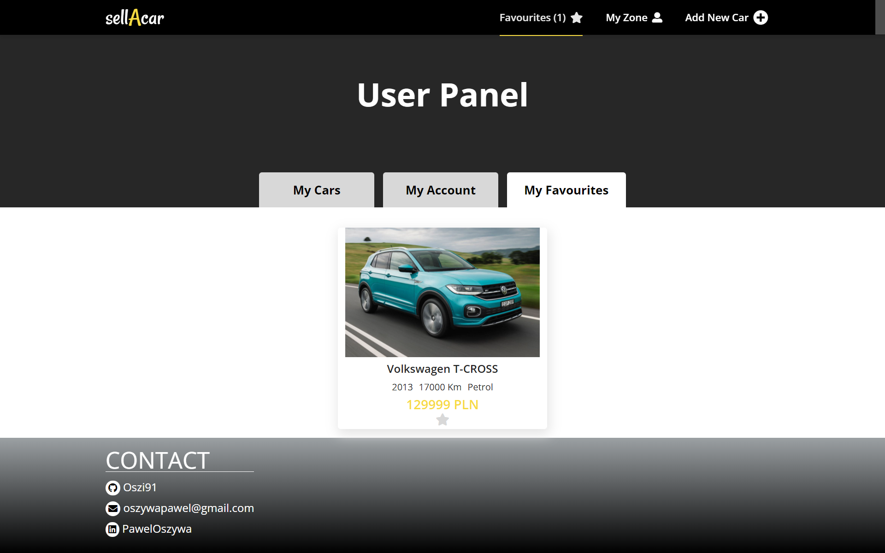
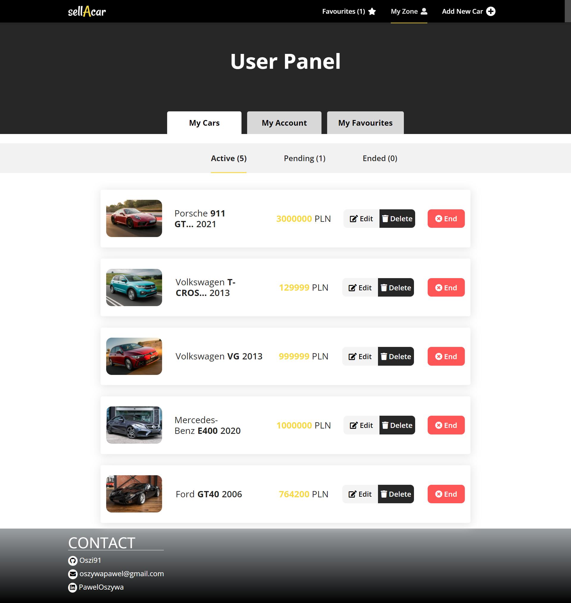
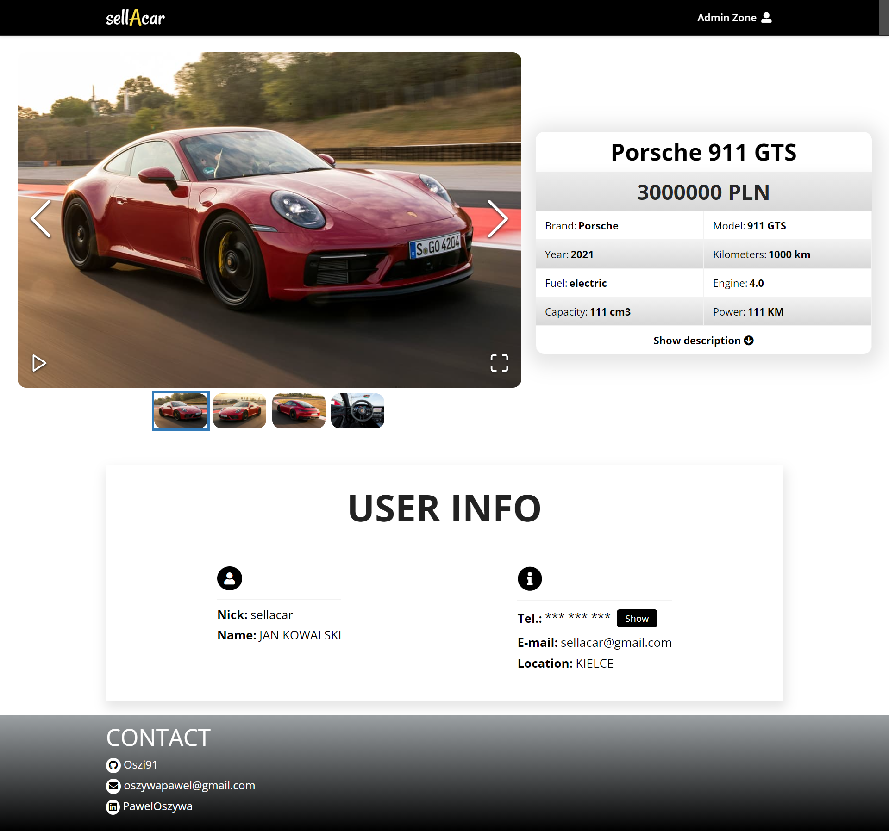
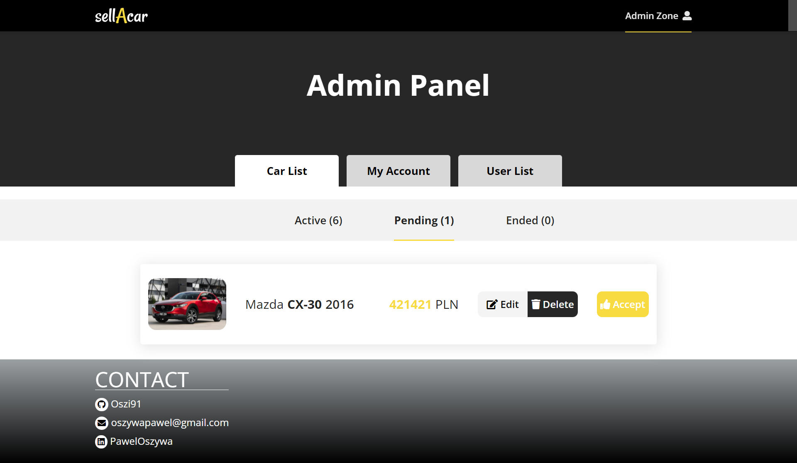
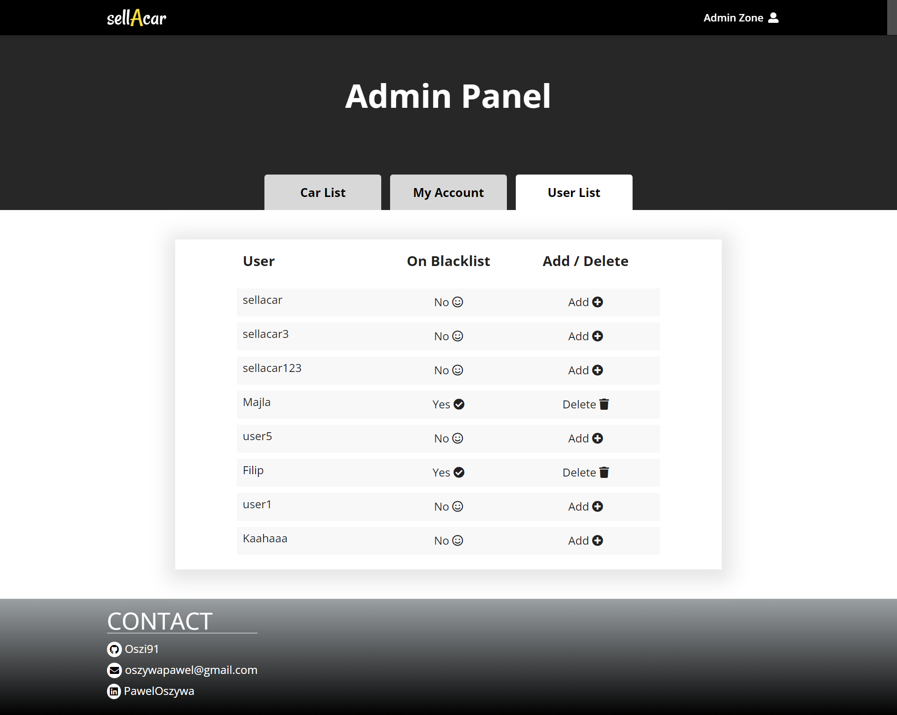

# sellAcar - Live Demo
[sellAcar - Live Demo](https://oszi91.github.io/sellAcar)

## Description:
Find your car or try to sell it. 
When you are not logged in, simply search for the car you are interested in using the search engine and the relevant parameters. 
Create your account by entering the relevant data. No verification link will be sent to your email, so you don't have to worry about it. If you already have an account, but you have forgotten your password, then you will get an email notification.
#### User
Once you are logged in, you can fill in your contact details.  Add your car. Fill in the mandatory fields, you can also add additional information, pictures (with drag and drop order) and edit your previously entered contact details. Once you have added your car, it will have to be approved by admin. You can edit or delete it at any time, even before it has been verified by the admin.  Once it is accepted, you will also be able to end it, and then possibly resume it. For every change you need admin approval. 
When you are logged in you can add a car from the list to your favourites. 

#### Admin
Also check how the admin panel looks like.
> Login: sellacaradmin@gmail.com
> Password: 123456

Now you have access to all cars of all users. In the pending tab you can accept an ad, then it will appear on the home page. You can edit all data, except adding new pictures. You can also add a user to your blacklist or remove them from it. When you do this, the user will have the appropriate information on his page, and his cars will disappear from the main page. 

## sellAcar - Preview








## Technologies:
| Tool | Description |
| :-------------:|--------------|
| HTML5 | A markup language used for structuring, and presenting content on the World Wide Web. |
| SASS | 	A preprocessor scripting language that is interpreted or compiled into CSS. |
| React | JavaScript library for creating user interfaces. |
| React Beautiful DND | Create drag and drop for lists/images. |
| React Router Dom | DOM bindings for React Router. |
| React Image Gallery | Supports multiple items slider. |
| Firebase | Tools from Google for building app infrastructure, improving app quality and growing your business like Realtime Database, Cloud Firestore, Storage, Cloud Messaging or Authentication. |
| UUID | Universally unique identifier generator. |
| Webpack | Packs CommonJs/AMD modules for the browser. Allows to split your codebase into multiple bundles, which can be loaded on demand. |

## Installation:

-  ```git clone https://github.com/oszi91/sellAcar``` to clone the repository.
-  npm install to install all dependencies
-  npm start and http://localhost:3001/ in the browser to preview the app